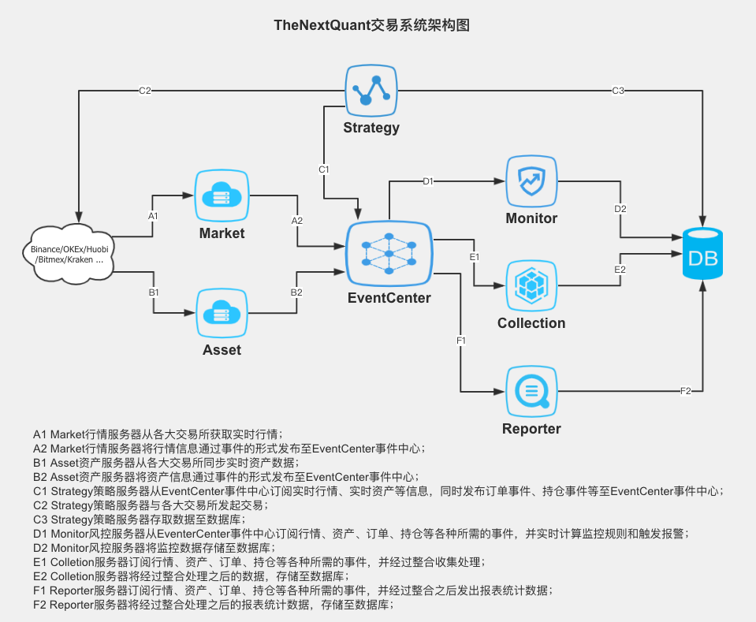
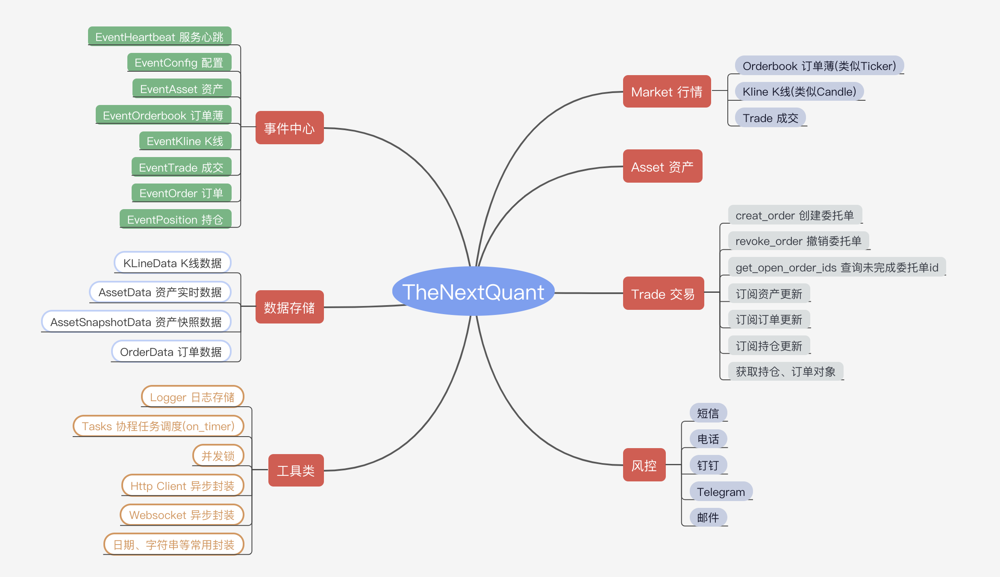

## 简介
- tythenextquant是基于开源的thenextquant做的二次开发
- 代码托管于gitee.com

- 1、安装setuptools wheel
```
python -m pip install  --upgrade setuptools wheel 
```
- 2、打包
```
python setup.py sdist bdist_wheel
```
- 3、上传测试服务
- 配置.pypirc文件，项目主目录及系统用户目录（C:\Users\pc）均要有
```python
#上传到私有pypi
python setup.py sdist upload -r tynbtop

#上传pypi测试网
python -m twine upload --repository testpypi dist/*


xunfeng
#使用代理，临时设置命令为
set https_proxy=http://127.0.0.1:1081
```

- 4、从测试服务安装
```python
#从私有pypi安装
python -m pip install --trusted-host tynb.top:8080 -i http://tynb.top:8080/simple/ tythenextquant

#安装库
python -m pip install --index-url https://test.pypi.org/simple/ --no-deps tythenextquant
#安装库并安装依赖
python -m pip install --index-url https://test.pypi.org/simple/ tythenextquant
```

- 5、从测试服务更新
```python
#从私有pypi更新
python -m pip install --trusted-host tynb.top:8080 --upgrade -i http://tynb.top:8080/simple/ tythenextquant

#更新库
python -m pip install --upgrade --index-url https://test.pypi.org/simple/ --no-deps tythenextquant

#更新库并更新依赖
python -m pip install --upgrade --index-url https://test.pypi.org/simple/ tythenextquant
```

## TheNextQuant

异步事件驱动的量化交易/做市系统。






### 框架依赖

- 运行环境
	- python 3.5.3 或以上版本

- 依赖python三方包
	- aiohttp>=3.2.1
	- aioamqp>=0.13.0
	- motor>=2.0.0 (可选)
	- psutil>=5.8.0

- RabbitMQ服务器
    - 事件发布、订阅

- MongoDB数据库(可选)
    - 数据存储


### 安装
使用 `pip` 可以简单方便安装:
```text
pip install thenextquant
```

or

```text
pip install -e git+https://github.com/TheNextQuant/thenextquant.git#egg=thenextquant
```

### Demo使用示例

- 推荐创建如下结构的文件及文件夹:
```text
ProjectName
    |----- docs
    |       |----- README.md
    |----- scripts
    |       |----- run.sh
    |----- config.json
    |----- src
    |       |----- main.py
    |       |----- strategy
    |               |----- strategy1.py
    |               |----- strategy2.py
    |               |----- ...
    |----- .gitignore
    |----- README.md
```

- 快速体验示例
    [Demo](example/demo)


- 运行
```text
python src/main.py config.json
```


### 使用文档

本框架使用的是Python原生异步库(asyncio)实现异步事件驱动，所以在使用之前，需要先了解 [Python Asyncio](https://docs.python.org/3/library/asyncio.html)。

- [服务配置](docs/configure/README.md)
- [行情](docs/market.md)
- [交易](docs/trade.md)
- [资产](docs/asset.md)
- 当前支持交易所
    - [Binance 币币](example/binance)
    - [Binance 合约](example/binance_future)
    - [OKx 币币](example/okx)
    - [OKx Margin 杠杆](example/okex_margin)
    - [OKx Future 交割合约](example/okex_future)
    - [OKx Swap 永续合约](example/okex_swap)
    - [Deribit 合约](example/deribit)
    - [Bitmex 合约](example/bitmex)
    - [Huobi 币币](example/huobi)
    - [Huobi Future 合约](example/huobi_future)
    - [Coinsuper 币币](example/coinsuper)
    - [Coinsuper Premium 币币](example/coinsuper_pre)
    - [Kraken 币币/杠杆](example/kraken) 
    - [Gate.io 币币](example/gate)
    - [Kucoin 币币](example/kucoin)
    - To be continued ...

- 其它
    - [安装RabbitMQ](docs/others/rabbitmq_deploy.md)
    - [日志打印](docs/others/logger.md)
    - [定时任务](docs/others/tasks.md)

- [框架使用系列课程](https://github.com/TheNextQuant/Documents)


### Change Logs
- [Change Logs](/docs/changelog.md)


### FAQ
- [FAQ](docs/faq.md)
