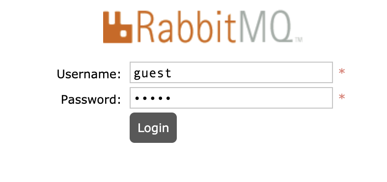
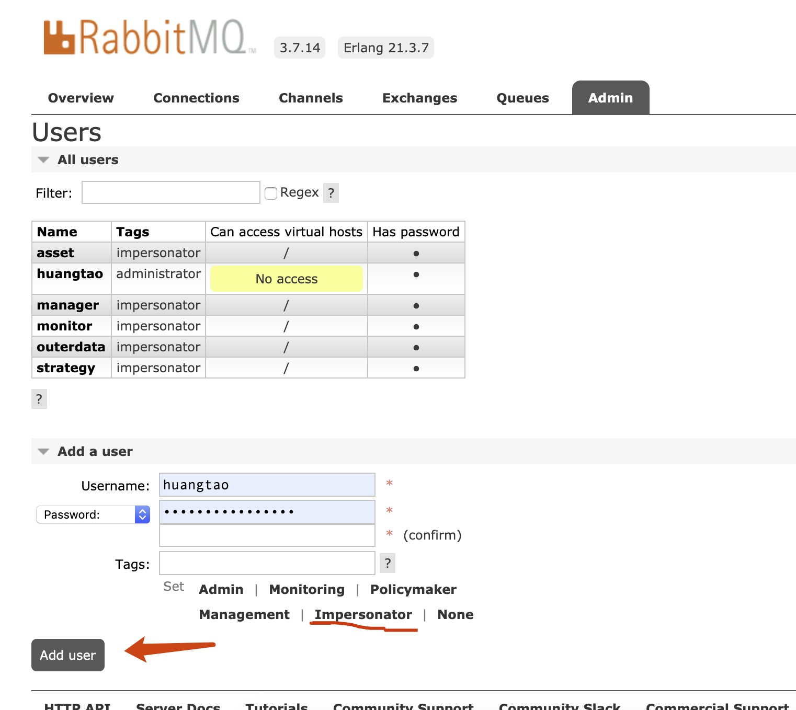
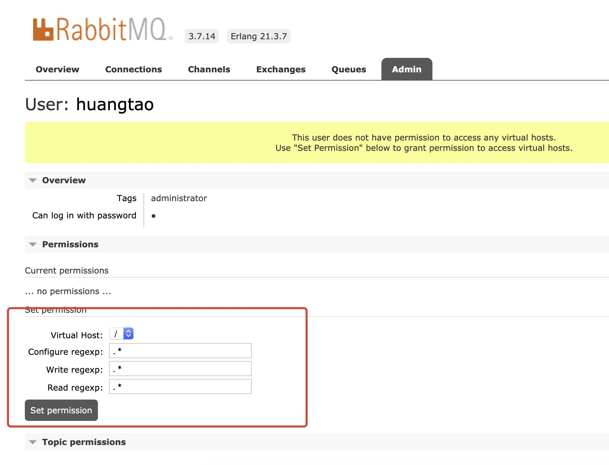
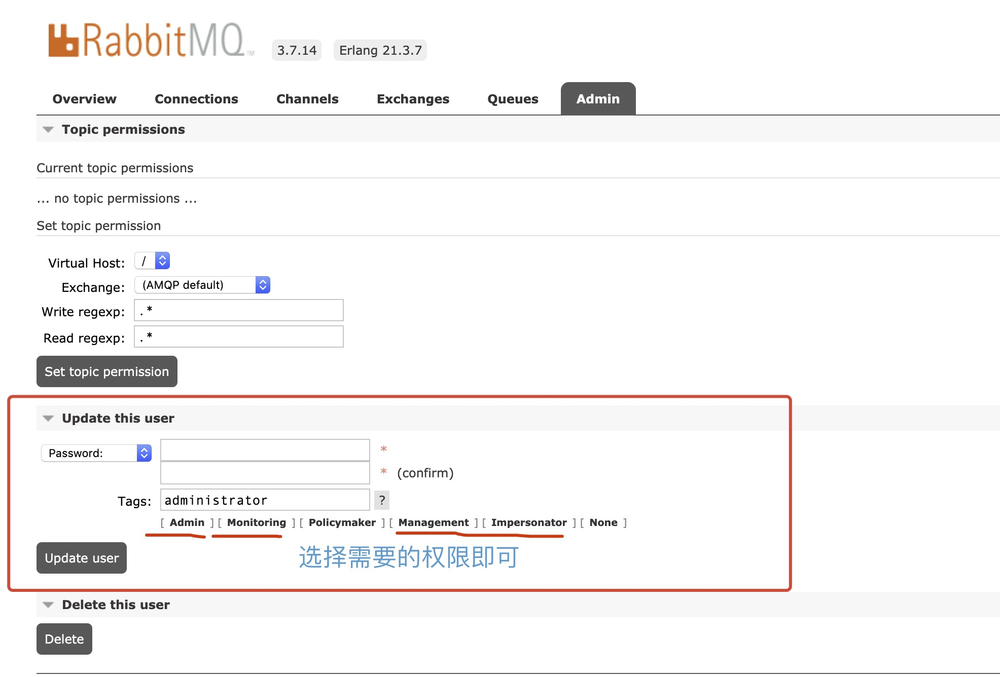

## RabbitMQ服务器部署

[RabbitMQ](https://www.rabbitmq.com/) 是一个消息代理服务器，可以作为消息队列使用。本文主要介绍 RabbitMQ 的安装部署以及账户分配。


### 1. 安装

##### 1.1 通过官网提供的安装文档来安装

RabbitMQ的官网提供了非常详细的 [安装文档](https://www.rabbitmq.com/download.html)，主流使用的操作系统都有对应安装文档说明，这里就不做过多说明了。

> 注意：
- 需要安装 [management](https://www.rabbitmq.com/management.html) 管理工具；


##### 1.2 通过docker安装

如果安装了 [docker server](https://www.docker.com/)，那么通过docker安装是比较方便的，只需要一行代码即可启动一个RabbitMQ实例:

```bash
docker run -d --restart always --name rabbitmq -p 5672:5672 -p 15672:15672 rabbitmq:3-management
```

> 说明：
- 这条命令启动了一个名叫 `rabbitmq` 的docker容器，容器内部运行了一个RabbitMQ的实例，并且和宿主机绑定了 `5672` 和 `15672` 端口；
- 端口 `5672` 为RabbitMQ服务器监听的 TCP 端口；
- 端口 `15672` 为RabbitMQ管理工具监听的 HTTP 端口；


### 2 设置账户密码

RabbitMQ可以通过命令行来操作，但为了展示一个更加直观的结果，这里我们使用管理工具来创建账户。

##### 2.1 登陆管理工具

假设我们安装运行RabbitMQ服务器的机器ip地址为 `120.26.56.32`，那么我们可以通过 `http://120.26.56.32:15672` 打开web管理页面。
管理页面默认的登录账户和密码为 `guest` `guest`，如下图所示：


登录成功之后，进入 `Admin` 标签页，新增、管理登录账户和密码：


请注意，新增的账户需要设置对应的访问权限，根据需要设置权限即可，一般如果测试使用直接给根目录 `/` 的访问权限：




恭喜你，我们的RabbitMQ服务器已经可以投入使用了！
